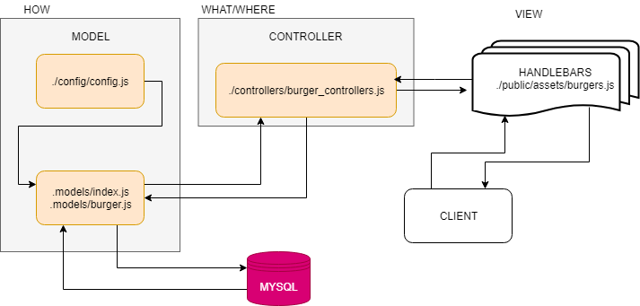

# EAT DA BURGER!!  🍔 
Week 14  HW- Node Express Handlebars
## Revised to SEQUELIZE

[Heroku Deployment](TBD)
 ! add burger emoji

## How to use the Eat-Da-Burger App
1. Type in the burger you wish to eat and submit to the burger database.
    * You may add as many burgers as you wish
2. You burgers will be displayed on the page.
3. Once you have devoured a burger, hit the `devoured` button to remove it from the list and add it to the devoured list. 

## Functionality (ORM)
1. Eat-Da-Burger application utilizes the MVC architecture to interface between the HTML page and the SQL burger database. 
2. Object Relational Mapping `ORM` is utilized to create the SQL statement functions into an exportable object. 

## Functionality (SEQUELIZE) - INCOMPLETE

* see Pseudo Code Below

### Pseudo Code:
#### MODEL:
1. Model to handle the "How" of the application
2. Burger.js Model created using Sequelize CLI using the following CLI commands:
    * `npx sequelize-cli init`
    * `npx sequelize-cli model:generate --name Burger --attributes ame:text,devoured:boolean`   
3. Data validation incorporated after model was created `notEmpty: true`
4. config.json updated to reflect MYSQL credentials
 

#### VIEW: 
1. Handlebar HTML template handles the data coming back from the burgers table and passes it into the HTML  

#### CONTROLER:
1. Controller to handle the "where" & the "what 
2. burgers_controller.js requires the Burger Model peforms the CRUD operations
3. API routes are established within the controller
    * `app.get("/")` peforms a `db.Burger.findAll` using sequelize synatx to retrive all items from the burgers_db
    * `app.post("/api/burger")`to add a new burger to the burgers table via the HTML AJAX using & sequelize `db.Burger.create` method.
    * `app.put("/api/burger/:id")` uses the data-attribute data-burger-id to associate the button to the buger from the bugers table inorder to update the devoured boolean using the `db.Burger.update` method
    * `app.delete("/api/burger/:id")` uses the data-attribute data-burger-id to associate the button to the buger from the bugers table in order to use the sequelize `db.Burger.destroy` method.

## Node Packages used:
- [Express](https://www.npmjs.com/package/express)
- [MYSQL](https://www.npmjs.com/package/mysql)
- [Express-Handlebars](https://www.npmjs.com/package/express-handlebars)
- [Node-Sequelize](https://www.npmjs.com/package/sequelize)
- [Sequelize-Documentation  ](http://docs.sequelizejs.com/)

